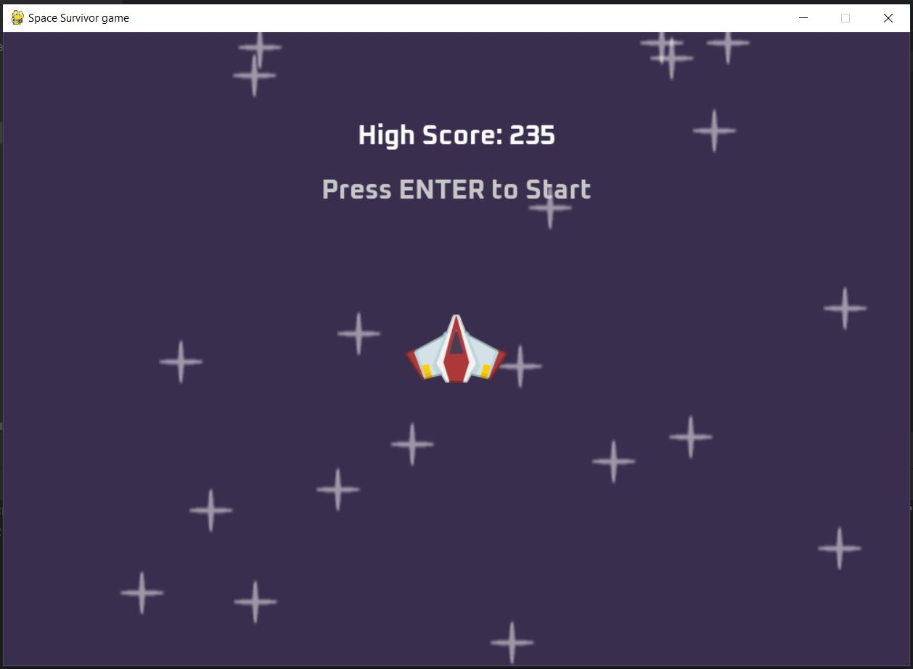
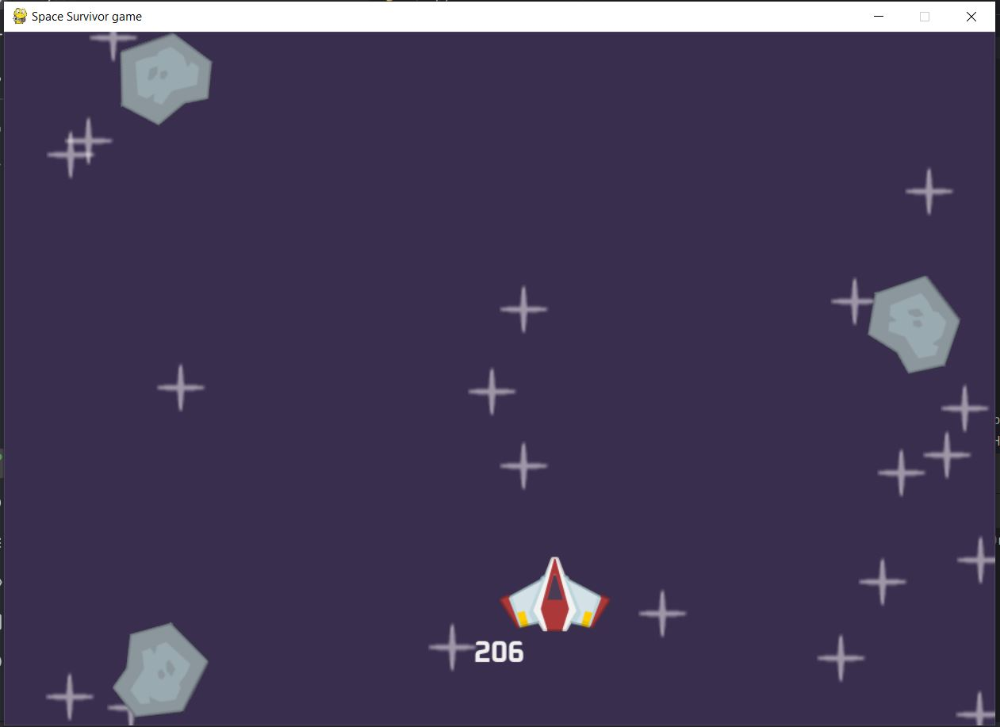
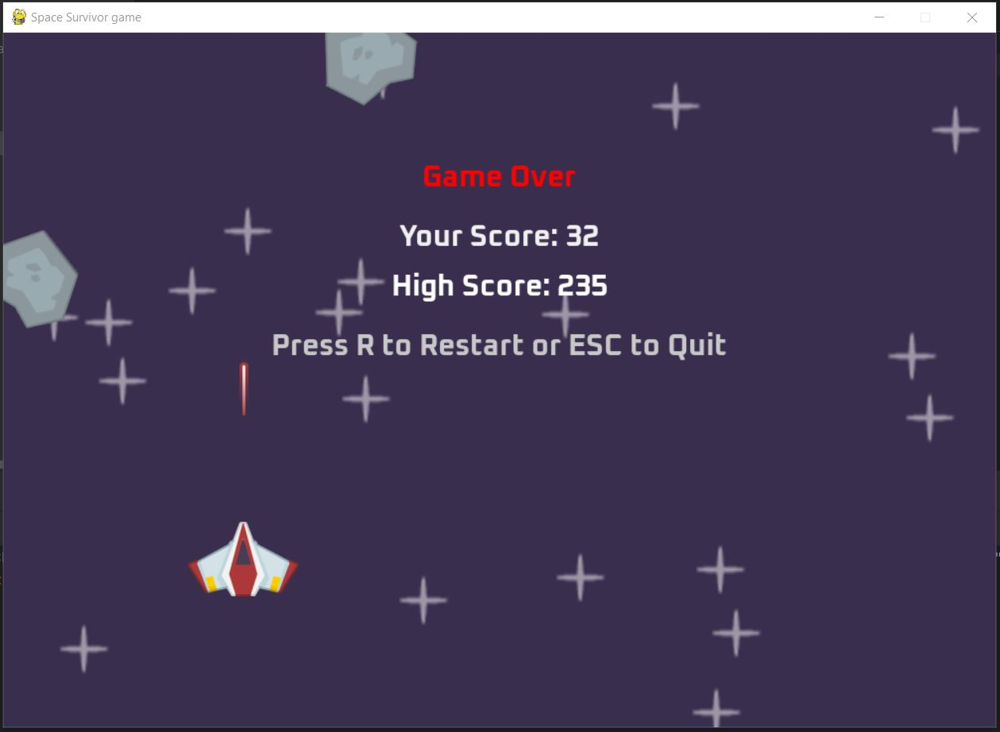

# 🚀 Space Survivor Game

A simple space shooter game built using Python and Pygame.

---

## 🎮 Features

- 🛸 Move your spaceship with arrow keys
- 🔫 Shoot incoming meteors with SPACE
- 🌟 Beautiful starry background
- 💥 Explosions on impact
- 🧠 High score saved to `high_score.txt`
- 📊 Score based on survival time
- 🕹️ Main menu before game starts
- 🔁 Game Over screen with restart option

---

## 🖼️ Preview

### 🕹️ Main Menu

### 🚀 Gameplay

### ☠️ Game Over Screen


---

## 🛠 Requirements

Install dependencies:

```bash
pip install -r requirements.txt
```
## 🚀 How to Run
```bash
python main.py
```
## 📁 Project Structure
```css
Copy
Edit
.
├── images/
│   ├── player.png
│   ├── laser.png
│   ├── meteor.png
│   ├── Oxanium-Bold.ttf
│   ├── star.png
│   ├── screenshots/
│   │   ├── Game_over.JPG
│   │   ├── Mainmenu.JPG
│   │   └── Play.JPG
│   └── explosion/
│       ├── 0.png
│       └── ...
├── audio/
│   ├── laser.wav
│   ├── explosion.wav
│   ├── damage.ogg
│   └── game_music.wav
├── main.py
├── high_score.txt
├── requirements.txt
└── README.md

```
## 🙌 Credits
Created by Kashi Nath Chourasia\
Made with ❤️ using Python + Pygame

## 📜 License
This project is for learning and personal use. No commercial rights granted.
